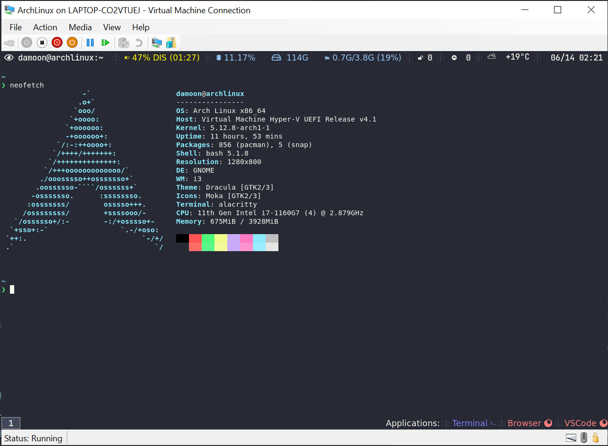

# archlinux-regolith-de



- [archlinux-regolith-de](#archlinux-regolith-de)
  - [overview](#overview)
  - [usage](#usage)
    - [assumptions](#assumptions)
    - [hyper-v Setup](#hyper-v-setup)
    - [Arch Linux Setup](#arch-linux-setup)
    - [hyperv-finalization](#hyperv-finalization)
    - [Arch Linux post-setup](#arch-linux-post-setup)
  - [references](#references)

## overview

This repository contains powershell and bash scripts to setup Arch Linux with [Regolith](https://regolith-linux.org) desktop environment.

- personally, I have found that Arch Linux inside a Hyper-V box with 4GB of ram and 4 Logical cores performs significantly better
  than Windows host that has 16 GB of ram and 8 Logical cores. The laptop I am using is Lenvo X12 , and for windows updates , I am on insider channel.
- I am using `btrfs` file system for arch installation.
- this installation only uses i3 window manager
- I am using regolith flavored i3, as I really like the defaults it provides
- in case you are not using these scripts to install Arch in hyper-v, you would need to remove hyper-v specific pieces from `02-arch-setup.sh` ; namely the sections that setup `xrdp` and `Microsoft/linux-vm-tools` ( lines `401`-`418`)

## usage

### assumptions

- you are running windows 10 pro with hyper-v enables
- you have admin privileges
- your host has 16GB of memory. this is not a hard requirement
- your host cpu has 8 logical cores.this is not a hard requirement
- `aria2` is installed in windows. you can use package managers such as scoop to install it.
- you have cloned this repository to your disk

### hyper-v Setup

- modify `01-hyperv-init.ps1` script to suit your needs by modifying variables in `VM CONFIG` section of the script:
  - set `$$VMName` to change VM name from default value
  - set `$MemoryStartupBytes` to the amount of RAM you want to allocate for the VM. I would recommend setting VM ram to a quarter of what is available on host, as Windows seems to have horrendous memory management.
  - set `$VMProcessorCount` to the amount of Logical CPU cores you want to allocate to the VM. I would recommend using half of the logical cores available on your CPU.
  - set `$VHDSizeBytes` to the amount of HDD you want to allocate to the VM
- open a new powershell window in administrator mode.
- run `01-hyperv-init.ps1` script.
- start the VM

```powershell
Start-VM -Name $VMName
```

- connect to the VM through Virtual Machine Connection (VMConnect)

```powershell
$HOSTNAME = (Get-WmiObject -Class Win32_ComputerSystem -Property Name).Name
VMConnect $HOSTNAME $VMName
```

- inside arch installer media shell, set a root password and enable ssh

```bash
echo 'root:root' | chpasswd
systemctl start sshd
```

- inside your elevated powershell window, run the following snippet to extract list of IP V4 addresses of the interface, as we will ssh into it from powershell in arch install stages.

```powershell
$IPV4Pattern = '^(?:(?:0?0?\d|0?[1-9]\d|1\d\d|2[0-5][0-5]|2[0-4]\d)\.){3}(?:0?0?\d|0?[1-9]\d|1\d\d|2[0-5][0-5]|2[0-4]\d)$'
Get-Vm -Name $VMName  | `
Select-Object -ExpandProperty Networkadapters | `
Select-Object -ExpandProperty IPAddresses | `
Where-Object -FilterScript { $_ -match $IPV4Pattern } | `
Select-Object -First 1
```

- open a new, non elevated powershell window. ssh into the VM in the new window. the ssh password will be `root`. You can use the following snippet ; change `192.168.2.246` to match IP address of your VM

```powershell
ssh -o StrictHostKeyChecking=no -o UserKnownHostsFile=/dev/null root@192.168.2.246
```

- do not close the elevated powershell window as you need it in the following steps.

### Arch Linux Setup

- modify `02-arch-setup.sh` script. search for `damoon` and change it to the username of your own choosing.
- move script into the VM with scp. execute this command in the other powershell window.

```powershell
scp -o StrictHostKeyChecking=no -o UserKnownHostsFile=/dev/null 02-arch-setup.sh root@192.168.2.246:/root/
```

- execute the script in the ssh session you opened.

```bash
bash /root/02-arch-setup.sh
```

- after the script has finished execution, it would turn off the VM. you should be ready to use the VM.

### hyperv-finalization

- this phase is not mandatory.
- Enable enhanced session mode. I highly encourage using enhanced session mode.

```powershell
Set-VM -VMName $VMName -EnhancedSessionTransportType HvSocket
```

- Change boot order for VM

```powershell
$gen2 = Get-VMFirmware $VMName
$gen2file = $gen2.BootOrder[0]
Set-VMFirmware -VMName $VMName -FirstBootDevice $gen2file
Get-VMFirmware $VMName
```

- Remove DVD from VM with same SCSI as HDD

```powershell
Get-VMDvdDrive -VMName $VMName -ControllerNumber 0 | Remove-VMDvdDrive
```

- Remove DVD Scsi controler from VM

```powershell
Get-VMScsiController -VMName $VMName -ControllerNumber 1 | Remove-VMScsiController
```

### Arch Linux post-setup

- this phase is not mandatory.
- `02-arch-setup.sh` script sets up default regolith look. in I have included my dotfiles under `dotfiles` folder. In the following steps, I will show you how to create your own dotfiles repo , put my dotfiles in it and use `rcm` for managing your VMs dotfiles.
- install [rcm](https://github.com/thoughtbot/rcm)
- create a repository for your box's dot files, e.g `hyperv-dotfiles`
- clone the empty repository to `~/.dotfiles`

```bash
git clone /repo/uri.git ~/.dotfiles
```

- copy all files in this repository's `dotfiles` directory to  `~/.dotfiles`

```bash
cp -r dotfiles/* ~/.dotfiles/
```
- commit and push the changes for your  `hyperv-dotfiles` repository.
- run `rcup` in your shell to have it create the symlinks for you. accepts all changes.
- restart your VM. You should have the same environment as mine.

## references

- https://www.distrotube.com/guest-articles/managing-dotfiles-with-rcm.html
- https://thoughtbot.com/upcase/videos/manage-and-share-your-dotfiles-with-rcm
- [ TODO ] https://social.technet.microsoft.com/Forums/en-US/7090c940-ac19-4f11-9316-666301889248/virtual-machine-connection-the-session-was-disconnected-if-you-want-to-continue-try-to-connect?forum=win10itprovirt
